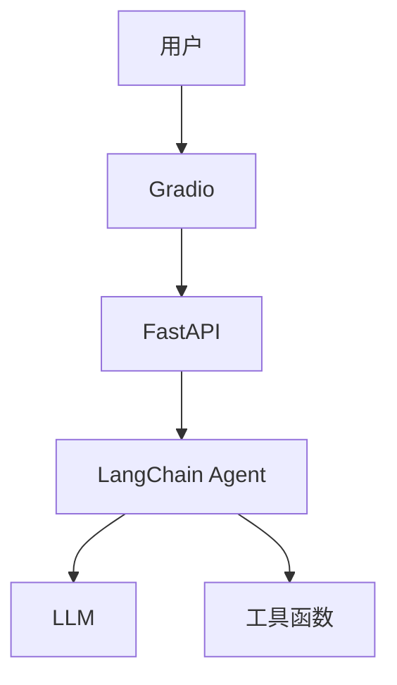

```mermaid
graph TD
    U[用户] --> G[Gradio]
    G --> F[FastAPI]
    F --> A[LangChain Agent]
    A --> L[LLM]
    A --> T[工具函数]
```

点击展开：完整的 API 文档

## API 文档
| 接口 | 方法 | 说明 |
|------|------|------|
| /chat | POST | 对话接口 |
| /health | GET | 健康检查 |

